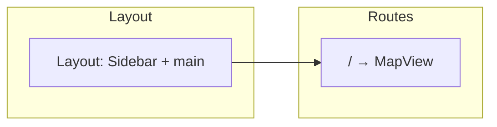
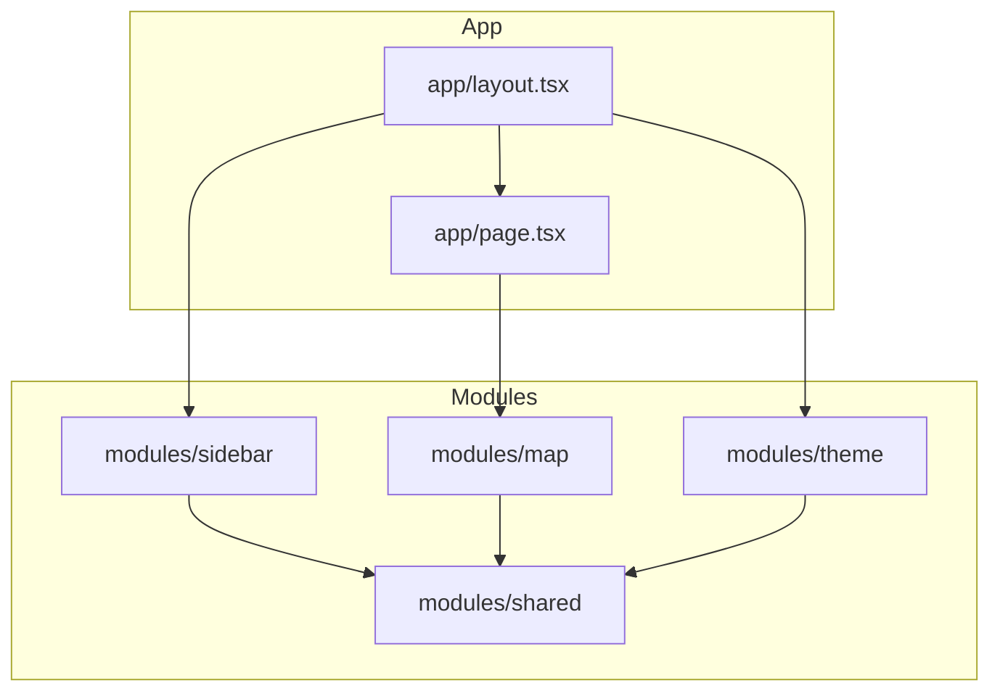
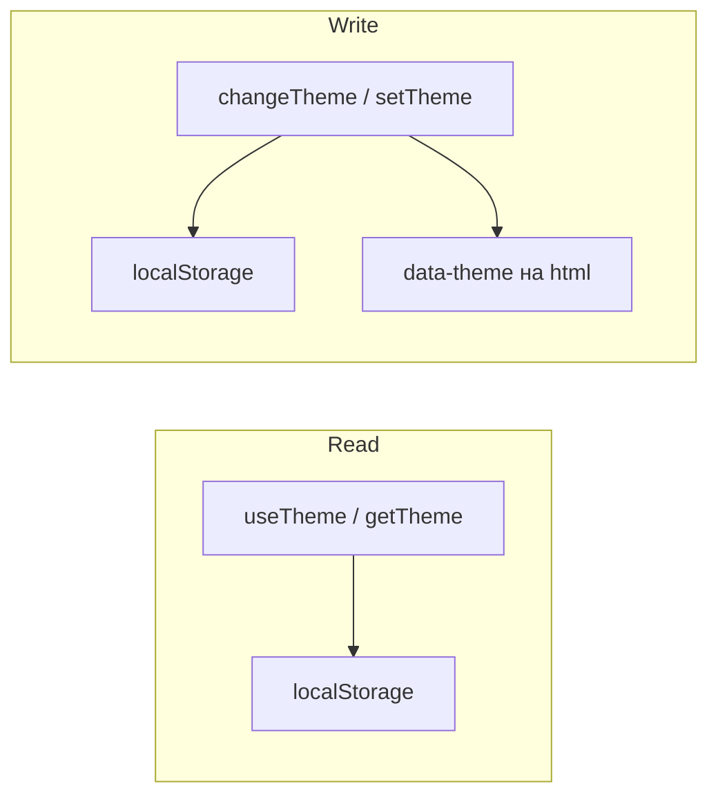

# Space — Architecture Vision (системный дизайн)

Роль: **системный дизайнер и архитектор приложения.** Целевая архитектура для устранения текущих проблем и масштабирования.

Контекст: [CURRENT-DESIGN-PROBLEMS.md](./CURRENT-DESIGN-PROBLEMS.md), [UI-UX-VISION.md](./UI-UX-VISION.md).

---

## 1. Целевая роутинг-модель

| URL   | Контент | Примечание |
|-------|---------|------------|
| `/`   | Карта   | Главный экран. Один layout: сайдбар + карта в main. |
| `/map` | —      | Убрать или редирект на `/`. Дублирует корень. |

**Исправление проблем:** точка входа = карта; нет экрана с карточками; нет двух путей к одному экрану. General как отдельная страница с карточками не нужна.



---

## 2. Модули и слои (apps/web)

```
apps/web/
  app/                    # Next.js: layout, роуты
    layout.tsx            # Shell: Sidebar + main, провайдеры (theme и т.д.)
    page.tsx              # / → Map.View (карта)
    globals.css
  modules/
    map/                  # Карта: view, components, hooks, api, mocks
    sidebar/              # Сайдбар: widget, components, types, constants
    theme/                # Тема: store/context, hooks, constants, types
    shared/               # Общее: utils, при необходимости типы
```

**Зависимости между модулями:**



- **Layout** знает только: Sidebar (виджет), Theme (провайдер/контекст при необходимости), `children` (страница).
- **Layout не знает** про внутренности map (компоненты, API, стейт карты).
- **Map module** знает про свою карту (CanvasMap, MapModeResolver, useMapMode, api/mocks). Не знает про theme/sidebar, кроме общих shared.
- **Theme** даёт провайдер и хук; layout или sidebar подключают. Тема читается/пишется в localStorage (ключ из theme constants).
- **Sidebar** получает `links` и `logoText` пропсами из layout; конфиг ссылок можно вынести в constants в app или в sidebar.

---

## 3. Потоки данных

### 3.1 Тема



- **Чтение:** при загрузке — `getTheme()` из localStorage (или default). В UI — хук `useTheme()` (theme + onChange).
- **Запись:** `changeTheme(next)` пишет в localStorage, обновляет `document.documentElement.dataset.theme` (или класс), триггерит ре-рендер через стейт в провайдере/хуке.
- **Ключ хранилища:** константа в `modules/theme/constants/`.

### 3.2 Состояние карты (pan, zoom — при появлении)

- **Где:** внутри модуля map (hooks или store). Не глобальный стейт приложения.
- **Поток:** пользователь двигает карту → обработчики в CanvasMap обновляют локальный стейт или ref; при необходимости синхронизация с URL (query: `?lat=&lng=&zoom=`) — тогда чтение при монтировании из URL, запись при изменении через router.replace.

### 3.3 Навигация (роуты)

- **Источник правды:** Next.js router (`/`).
- **Сайдбар:** ссылки задаются конфигом (массив `{ href, label, icon }`). Для MVP: одна ссылка «Главная» или «Карта» на `/`. Пункт «General» с карточками убрать.
- **Активное состояние:** по `pathname` (usePathname) — какой `href` совпадает, тот подсвечивается.

---

## 4. Границы модулей

| Кто        | Знает / делает |
|-----------|-----------------|
| **Layout** | Рендерит SidebarWidget и children. Передаёт links в sidebar. Оборачивает в ThemeProvider при необходимости. Не импортирует Map. |
| **app/page.tsx** | Импортирует Map.View (или аналог из modules/map), рендерит в main. Не знает про CanvasMap, useMapMode, api. |
| **Map module** | View, MapModeResolver, CanvasMap, useMapMode, api (client, mocks). Не знает про theme/sidebar. |
| **Theme module** | Провайдер (если нужен), useTheme, getTheme, changeTheme, константы. Не знает про map/sidebar. |
| **Sidebar module** | SidebarWidget, ссылки (получает пропсом), типы. Может использовать useTheme для переключателя. Не знает про map. |

**Общение:** пропсы (layout → sidebar: links), контекст (theme — провайдер в layout или в body), URL (роут). Модули не импортируют друг друга «напрямую» кроме явного публичного API (Map.View, Sidebar.SidebarWidget, Theme.useTheme).

---

## 5. Масштабирование

### 5.1 Новые экраны

- Добавить роут: `app/dashboard/page.tsx` (или другой путь).
- Добавить модуль: `modules/dashboard/` (view, components, api при необходимости).
- В layout или в конфиге сайдбара добавить пункт навигации `{ href: '/dashboard', label: 'Dashboard', ... }`.
- Главный экран остаётся `/` = карта; остальное — отдельные страницы.

### 5.2 Глобальное состояние

- **Тема:** уже «глобальная» через провайдер/контекст + localStorage.
- **Пользователь/сессия (позже):** отдельный модуль или app-level провайдер; layout подключает, модули получают через контекст или хук.
- **Стейт карты:** локальный модулю map; при необходимости «поделиться» с другими экранами — либо поднять в app-level store (Zustand/Jotai), либо передавать через URL.

### 5.3 API и моки

- В каждом модуле, где есть запросы: `modules/<name>/api/` (client, endpoints) и `modules/<name>/api/mocks/` (handlers, fixtures).
- Общий контракт и типы — в `packages/api-contracts`. MSW инициализация в app (провайдер/скрипт), список handlers собирается из модулей (map, …) и передаётся в worker.

### 5.4 Монорепо (apps, packages)

- **apps/web** — единственное приложение с модулями выше.
- **packages:** ui, api-contracts, msw-utils, typescript-config, eslint-config. Зависимости: app → packages; модули друг на друга не опираются, кроме shared.

---

## 6. Итог в одном абзаце

**Главный экран — карта на `/`; роут `/map` и экран General с карточками убраны. Layout рендерит сайдбар и children; page.tsx рендерит только Map.View. Модули (map, sidebar, theme, shared) изолированы по границам выше; тема и навигация идут через контекст/пропсы/URL. Масштабирование — новые роуты и модули, глобальный стейт только там, где нужен (theme, позже auth); API и моки — по модулям с общим контрактом в packages.**
