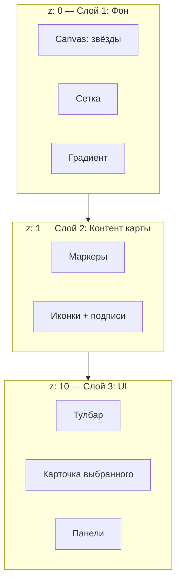
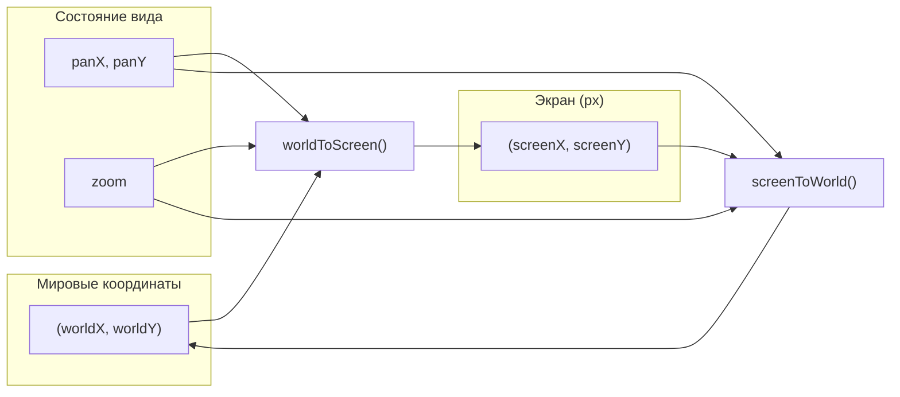
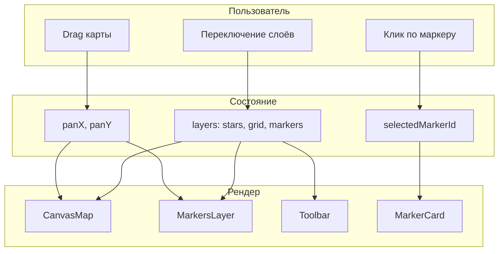
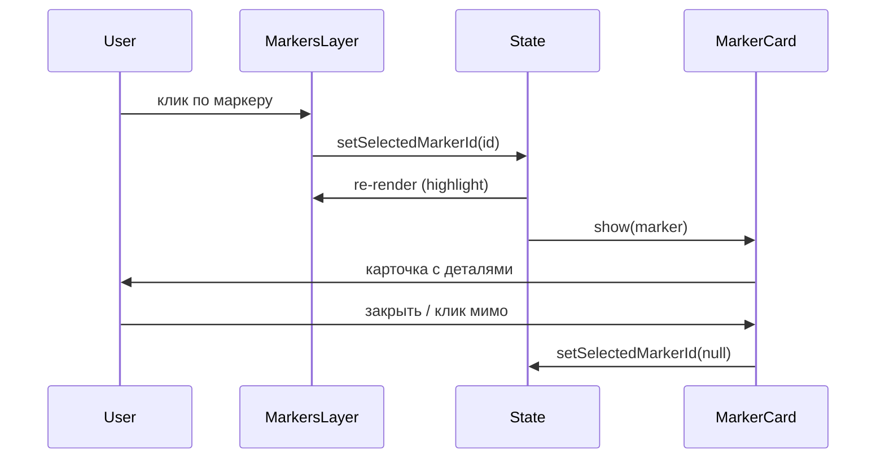
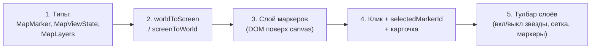

# Карта — дизайн и схема

Визуальная и структурная схема карты: слои, данные, координаты, сценарии.

---

## 1. Экран карты (макет)

```
┌────────────────────────────────────────────────────────────────────────────┐
│  [2D] [3D]    Layers: [✓ Stars] [✓ Grid] [✓ Markers]         [🔍] [⚙]     │  ← Тулбар
├────────────────────────────────────────────────────────────────────────────┤
│                                                                             │
│    ·              ·         ★                                              │
│  ·   ·   ★       ·    ·         ·                                          │
│        ·     ·   ·         ·        ·      ← Слой 1: звёзды + сетка (canvas)│
│  ·       [🛸]      ·    ·   ·                                               │
│    ·   ·     ·         [🪐]    ·     ·    ← Слой 2: маркеры (DOM или canvas)│
│  ·     ·    ·   ·   ·      [🔭]   ·                                         │
│    ·        ·    ·   ·         ·                                            │
│                                                                             │
│  ◀────────────────── pan (drag) ──────────────────▶                        │
│                                                                             │
│  Клик по маркеру → карточка / боковая панель                                │
└────────────────────────────────────────────────────────────────────────────┘
```

---

## 2. Слои (z-index и ответственность)



| Слой | Содержимое | Рендер |
|------|------------|--------|
| **1** | Звёзды, сетка, градиент | Canvas |
| **2** | Маркеры (точки, иконки, label) | DOM или второй Canvas |
| **3** | Тулбар, tooltip, панели | DOM |

---

## 3. Модель данных (сущности)

```mermaid
erDiagram
    MapViewState ||--o| Pan : has
    MapViewState ||--o| Zoom : has
    MapViewState ||--o| MapLayers : has
    MapLayers ||--o| starsVisible : boolean
    MapLayers ||--o| gridVisible : boolean
    MapLayers ||--o| markersVisible : boolean

    MapMarker ||--o| id : string
    MapMarker ||--o| worldX : number
    MapMarker ||--o| worldY : number
    MapMarker ||--o| label : string
    MapMarker ||--o| type : MarkerType
    MapMarker ||--o| description : string

    MapViewState ||--o{ MapMarker : displays
    SelectedMarker ||--o| MapMarker : references

    MapViewState {
        number panX
        number panY
        number zoom
    }

    MapMarker {
        string id
        number worldX
        number worldY
        string label
        MarkerType type
        string description
    }

    MarkerType {
        "ship"
        "station"
        "planet"
        "custom"
    }
```

---

## 4. Координаты: мир ↔ экран



**Формула (2D, zoom = 1):**

- `screenX = worldX - panX`
- `screenY = worldY - panY`
- `worldX = screenX + panX`
- `worldY = screenY + panY`

При zoom: домножать на `scale` и учитывать центр вида.

---

## 5. Поток данных и взаимодействия



---

## 6. Сценарий: выбор маркера



---

## 7. Порядок реализации



| Шаг | Что сделать |
|-----|-------------|
| 1 | Типы: `MapMarker`, `MarkerType`, `MapViewState`, `MapLayers`. Мок-массив маркеров. |
| 2 | Функции пересчёта координат с учётом pan (и zoom при появлении). |
| 3 | Контейнер поверх canvas, маркеры как DOM-элементы с позицией из `worldToScreen`. |
| 4 | State выбранного маркера, клик по маркеру, отображение карточки/панели. |
| 5 | Чекбоксы/переключатели слоёв в тулбаре, проброс в CanvasMap и слой маркеров. |

---

## 8. Структура компонентов (дерево)

```
MapView
├── MapModeProvider
│   ├── ToggleMapMode (2D/3D)
│   └── MapModeResolver
│       └── CanvasMap (звёзды, сетка)
├── MarkersLayer          ← поверх canvas, overflow: hidden
│   └── MapMarkerItem[]   (position from worldToScreen)
├── MapToolbar            ← слои, поиск, настройки
└── MarkerCard | SidePanel   ← при selectedMarkerId
```

---

Готово: одна схема в одном MD — макет экрана, слои, модель данных, координаты, поток и порядок реализации.
