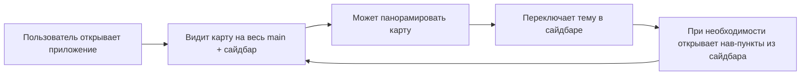

# Space — PM Vision (продукт и MVP)

Роль: **Product Manager.** Только продукт, сценарии и приоритеты.

Контекст: проблемы текущего дизайна — [CURRENT-DESIGN-PROBLEMS.md](./CURRENT-DESIGN-PROBLEMS.md). Целевой UX — [UI-UX-VISION.md](./UI-UX-VISION.md).

---

## 1. Видение продукта

**Space — клиентское веб-приложение, ядро которого — космическая карта.** Пользователь открывает приложение и сразу попадает на карту; сайдбар и панели поддерживают работу с картой (навигация, тема, позже — маркеры и профили).

**MVP в одной фразе:** один экран — карта на `/`, сайдбар с навигацией и темой; без экрана с карточками и без лишнего шага до карты.

---

## 2. Целевой user flow

- **Вход:** переход на корень домена (или `/`).
- **Первый экран:** сразу карта (не General, не карточки). Сайдбар слева: лого, навигация, тема, настройки.
- **Действия:** pan по карте; переключение темы; клик по пункту сайдбара (пока по сути один — «Главная»/карта).
- **Без лишних шагов:** нет «открыл → карточка → Open map → карта».

---

## 3. Scope MVP

| В scope | Описание |
|--------|----------|
| **Точка входа** | `/` отображает карту (главный экран). |
| **Роутинг** | `/` = карта. Пункт «General» с карточками убран или переосмыслен так, чтобы не дублировать путь к карте. |
| **Сайдбар** | Лого, нав (минимум — ссылка на главную/карту), переключатель темы, иконка настроек. Без отдельного раздела «General» с карточкой «Open map». |
| **Карта** | 2D, pan, инерция; фон (звёзды, сетка). Занимает основную область (main). |
| **Тема** | Light / Dark / Device; сохранение выбора (например localStorage). |

| Out of scope на текущий MVP |
|-----------------------------|
| Отдельная страница «General» с карточками как стартовый экран. |
| Дублирование пути к карте (сайдбар «Map» + карточка «Open map» на `/`). |
| Полноценный 3D-режим карты. |
| Маркеры, профили, API (следующая итерация). |
| Авторизация, админка, CI/CD. |

---

## 4. Definition of done для MVP

- [ ] Открытие по `/` показывает карту (не экран с карточками).
- [ ] Сайдбар присутствует: лого, навигация, тема, настройки.
- [ ] В сайдбаре нет лишнего пункта «General» с единственной карточкой «Open map»; путь к карте не дублируется.
- [ ] Тема переключается (Light / Dark / Device) и сохраняется между сессиями.
- [ ] Карта интерактивна: pan, инерция; визуал (звёзды, сетка) соответствует UI-UX-VISION.
- [ ] Один layout на всё приложение: сайдбар + main с картой; отдельного «лендинга» с карточками нет.

---

## 5. Приоритеты и порядок работ

| Порядок | Что делаем | Зачем |
|--------|------------|--------|
| 1 | **Роут и точка входа:** `/` рендерит карту, не HomeView с карточками. | Устраняет неверную точку входа; открыл приложение — сразу карта. |
| 2 | **Убрать/переосмыслить General:** удалить экран с карточкой «Open map» или заменить на что-то с ясной ролью (не дублирование сайдбара). | Убирает дублирование пути к карте и шум «General без пользы». |
| 3 | **Сайдбар:** нав-пункты приводят к одному главному экрану (карта); при необходимости один пункт «Главная» → `/`. | Навигация согласована с целевым flow. |
| 4 | **Тема:** переключатель в сайдбаре, сохранение в localStorage. | В scope MVP, не блокирует карту. |
| 5 | Доработка визуала карты (слои, тулбар 2D/3D при необходимости). | После того как структура экранов и роутов верна. |

**Откладываем на следующий этап:** маркеры с API/MSW, страница профиля, БД, авторизация — после закрепления «карта на `/` + сайдбар без дублирования».

---

## 6. Риски и ограничения

| Риск / ограничение | Митигация |
|--------------------|-----------|
| Остатки старой навигации (ссылки на `/map`, упоминания General) в коде или в головах. | Явно зафиксировать в доке и в задачах: `/` = карта; General не стартовый экран. Рефакторить ссылки и роуты под целевую модель. |
| «Главная» в сайдбаре при единственном экране может казаться лишней. | Допустимо один пункт «Главная» или «Карта» → `/`; альтернатива — только лого как переход на `/`. Решение по вкусу, главное — не два способа попасть на карту с разными смыслами (General vs Map). |
| MVP не включает маркеры и профили. | Осознанное ограничение: сначала корректная точка входа и структура экранов; данные и профили — следующий спринт. |

---

## 7. Связь с другими документами

- **Реализация проблем:** [CURRENT-DESIGN-PROBLEMS.md](./CURRENT-DESIGN-PROBLEMS.md) — что именно исправляем.
- **Визуал и экраны:** [UI-UX-VISION.md](./UI-UX-VISION.md) — как должны выглядеть карта и сайдбар.
- **Задачи:** [TASKS.md](./TASKS.md) — конкретные таски по спринтам (лейаут, карта, API, профиль).
- **Объём продукта:** [PROJECT.md](./PROJECT.md) — описание продукта, стек, MVP и backlog.
