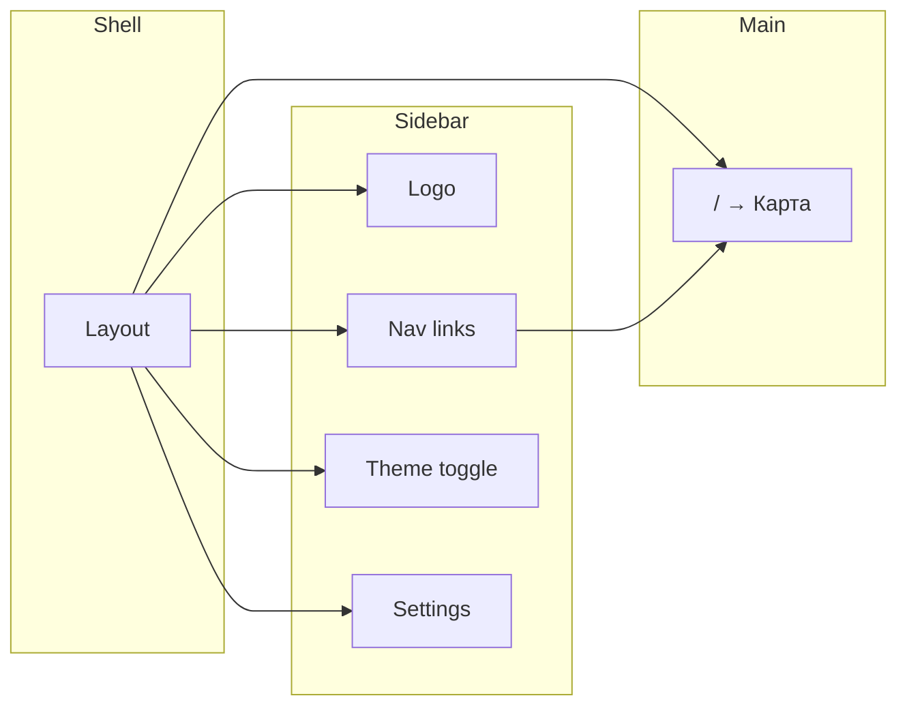
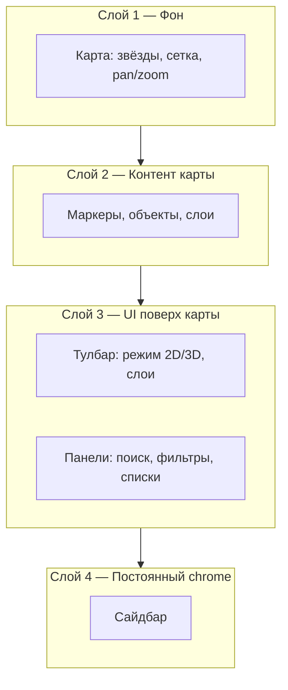
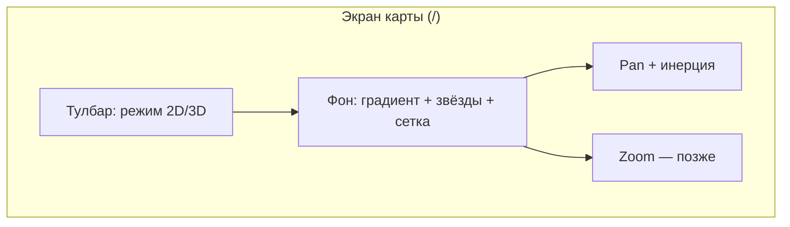

# Space — UI/UX Vision (визуальная часть)

Роль: **UI/UX дизайнер и верстальщик.** Только экраны, навигация и визуал.

---

## 1. Идея продукта (одной фразой)

**Один главный экран — космическая карта.** Всё остальное (сайдбар, тулбары, панели) поддерживает работу с картой, а не наоборот.

---

## 2. Архитектура экранов

```
┌─────────────────────────────────────────────────────────────┐
│  Сайдбар (фиксирован)  │  Основная область (flex: 1)        │
│                        │                                    │
│  Logo                  │   На MVP — только карта.           │
│  — Nav                 │   Позже: карта + панели поверх.    │
│  — Theme               │                                    │
│  — Settings (icon)      │   Карта = фон + контент.           │
└─────────────────────────────────────────────────────────────┘
```

Один layout на всё приложение: сайдбар слева, справа — контент. Отдельных «страниц-лендингов» с карточками нет.

---

## 3. Навигация (IA)



- **Корень `/`** — сразу карта (главный экран).
- **Сайдбар:** логотип, пункты навигации (пока по сути один — «Карта»/главная), переключатель темы, иконка настроек.
- Отдельная страница «General» с карточками не нужна: дублирует сайдбар и отнимает фокус у карты.

---

## 4. Визуальная иерархия



- **Слой 1:** карта как фон (звёзды, сетка, движение).
- **Слой 2:** то, что «живёт» на карте (точки, объекты).
- **Слой 3:** тулбары и панели поверх карты (полупрозрачные, с лёгким блюром, чтобы карта читалась).
- **Слой 4:** сайдбар — стабильная зона навигации и настроек.

Карта всегда видна; UI не перекрывает её полностью.

---

## 5. Карта как главный экран



- **Фон:** тёмный космический градиент, звёзды, лёгкая сетка.
- **Взаимодействие:** drag (мышь/тач) + инерция при отпускании.
- **Тулбар:** компактный, поверх карты (например, 2D/3D), без перекрытия всей карты.
- **Тема:** светлая/тёмная/device — карта и панели адаптируются (контраст, читаемость).

Визуальный фокус: «открыл приложение — сразу видишь карту и можешь её двигать».

---

## 6. Сайдбар (визуально)

```
┌──────────────────┐
│ #  Space         │  ← Логотип + название
├──────────────────┤
│                  │
│  🏠  Главная     │  ← Активный пункт (оранжевый фон)
│  🗺  Карта       │  ← Остальные — нейтральные
│  …               │
│                  │
├──────────────────┤
│  Theme           │
│  [Light|Dark|…]  │  ← Toggle, компактно
│                  │
│  [⚙]             │  ← Иконка-кнопка 40×40, лёгкая обводка
└──────────────────┘
```

- Узкая колонка (~260px), не перетягивает внимание.
- Чёткое разделение: навигация → тема → действия (настройки).
- Активное состояние — контрастное (например, оранжевый), остальное — спокойное.

---

## 7. Компоненты (с точки зрения вёрстки)

| Компонент        | Роль в UI |
|------------------|-----------|
| **Layout**       | Flex: сайдбар + main. Сайдбар фиксированной ширины, main заполняет остаток. |
| **Sidebar**      | Вертикальный блок: лого, список ссылок, футер с темой и кнопкой. |
| **SidebarLink**  | Строка: иконка + текст, скругление, активное состояние. |
| **Theme toggle** | Горизонтальный переключатель (Light / Dark / Device), один ряд. |
| **IconButton**   | Квадрат 40×40, обводка, hover — лёгкий фон. |
| **CanvasMap**    | На весь main: звёзды, сетка, pan, инерция. |
| **Toolbar (карта)** | Абсолют поверх карты, блюр/полупрозрачность, не перекрывает центр. |

Всё строится вокруг одной главной зоны — карты.

---

## 8. Тема и контраст

- **Тёмная тема:** карта и сайдбар в тёмных тонах, светлый текст, акцент (оранжевый) для активного и кнопок.
- **Светлая тема:** светлый сайдбар и панели, тёмный текст, тот же акцент.
- **Device:** следование за системой без отдельного экрана выбора.

Важно только: читаемость текста и иконок, контраст активных состояний и кнопок. Без бизнес- или SEO-логики.

---

## 9. MVP в одном предложении

**Один экран: карта на весь main + сайдбар с навигацией и темой.** Ни карточек на главной, ни лишних кликов — открыл приложение и сразу работаешь с картой.
